# Healthcare Microservices System

Modern healthcare management platform built with microservices architecture. Features secure patient data handling, appointment scheduling, pharmacy operations, and real-time analytics with event-driven communication.

---

## Project Status & CI/CD Integration

To keep the project organized and transparent:

- **Feature Progress** is tracked in [`SERVICE_ROADMAP.md`](./SERVICE_ROADMAP.md) at the repo root.  You’ll see exactly which endpoints and event‑listeners are ✅ implemented and which are still 🚧 pending.
- **Infrastructure Progress** lives in [`CROSS_CUTTING.md`](./CROSS_CUTTING.md), detailing what security, resilience, observability, and other cross‑cutting concerns have been put in place and what remains.

Every feature and infrastructure task is delivered via a dedicated **branch‑per‑service** GitHub Actions pipeline:

1. **Build** (compile JAR once, store as artifact)
2. **Analyze & Test** (Checkstyle, SpotBugs, unit/integration tests, Pact contracts)
3. **Scan** (Trivy/Snyk vulnerability checks)
4. **Package** (multi‑stage Docker build → non‑root JRE image)
5. **Publish** (push to Docker Hub with immutable `${SERVICE_NAME}:${GITHUB_SHA}` tags)

🔗 **Explore the full CI/CD workflows** (YAML definitions & logs):  
https://github.com/maalwis/Healthcare-Platform---Microservice-Architecture-CICD

---

## Table of Contents

* [System Architecture](#system-architecture)
* [Service Catalog](#service-catalog)
* [REST API Endpoints](#rest-api-endpoints)
  * [Patient Service](#patient-service)
  * [Appointment Service](#appointment-service)
  * [Staff Service](#staff-service)
  * [Pharmacy Service](#pharmacy-service)
  * [Inventory Service](#inventory-service)
  * [Billing & Claims Service](#billing--claims-service)
  * [Audit Logging Service](#audit-logging-service)
  * [Notification Service](#notification-service)
  * [Analytics Service](#analytics-service)
* [Event-Driven Architecture](#event-driven-architecture)
  * [Event Publishers](#event-publishers)
  * [Event Consumers](#event-consumers)

---

## System Architecture

### High-Level Architecture

---

### Request Flow

---

### Inter-Service Communication

---

### Message Broker (RabbitMQ)

---

## Service Catalog

| Service                | Key Responsibilities                                                                 | Core API Endpoints                                                                                                                                                                                                 | Published Events                                                                 | Consumed Events                                                                 |
|------------------------|-------------------------------------------------------------------------------------|--------------------------------------------------------------------------------------------------------------------------------------------------------------------------------------------------------------------|---------------------------------------------------------------------------------|---------------------------------------------------------------------------------|
| **Patient Service**    | Manage patient demographics, medical history, and record lifecycle                  | `GET /patients` `POST /patients` `GET /patients/{id}` `PUT /patients/{id}` `DELETE /patients/{id}` `GET /patients/search`                                                                          | `PatientRegistered` `PatientUpdated`                                        | -                                                                               |
| **Appointment Service**| Handle scheduling, rescheduling, and cancellation of medical appointments           | `GET /appointments` `POST /appointments` `GET /appointments/{id}` `PUT /appointments/{id}` `DELETE /appointments/{id}` `POST /appointments/{id}/cancel` `POST /appointments/{id}/reschedule`   | `AppointmentCreated` `AppointmentUpdated` `AppointmentCancelled`         | -                                                                               |
| **Staff Service**      | Manage healthcare staff profiles, availability, and assignments                     | `GET /staff` `POST /staff` `GET /staff/{id}` `PUT /staff/{id}` `DELETE /staff/{id}` `GET /staff/{id}/availability` `GET /staff/{id}/assignments`                                                | -                                                                               | -                                                                               |
| **Pharmacy Service**   | Process prescriptions, manage medication dispensing, and track drug inventory       | `GET /prescriptions` `POST /prescriptions` `GET /prescriptions/{id}` `POST /prescriptions/{id}/fill` `POST /medications/{id}/dispense`                                                                | `PrescriptionFilled` `MedicationDispensed`                                  | -                                                                               |
| **Inventory Service**  | Monitor medical supplies, manage stock levels, and handle reordering               | `GET /inventory` `POST /inventory` `GET /inventory/{id}` `PUT /inventory/{id}` `POST /inventory/{id}/reorder`                                                                                         | `StockLow` `StockReplenished`                                               | `MedicationDispensed`                                                          |
| **Billing & Claims**   | Handle invoicing, insurance claims processing, and payment reconciliation           | `GET /invoices` `POST /invoices` `GET /invoices/{id}` `GET /claims` `POST /claims` `GET /claims/{id}` `POST /claims/{id}/submit` `POST /claims/{id}/deny`                                   | `InvoiceGenerated` `ClaimSubmitted` `ClaimDenied`                        | `AppointmentCreated` `PatientRegistered`                                    |
| **Audit Logging**      | Maintain system-wide audit trail for compliance and security monitoring             | `GET /audit/events` `GET /audit/events/{id}`                                                                                                                                                                   | -                                                                               | All domain events                                                              |
| **Notification Service**| Manage real-time alerts via SMS/email for appointments, bills, and system events    | `GET /notifications` `GET /notifications/{id}` `PUT /notifications/config`                                                                                                                                  | -                                                                               | `AppointmentCreated` `AppointmentUpdated` `InvoiceGenerated` `ClaimDenied` |
| **Analytics Service**  | Provide business intelligence, reporting, and data visualization                    | `GET /analytics/dashboard` `GET /analytics/reports` `GET /analytics/events`                                                                                                                                 | `DashboardUpdated` `ReportGenerated`                                        | All domain events                                                              |
| **API Gateway**        | Central entry point for routing, security, and request orchestration                | N/A (Infrastructure Layer)                                                                                                                                                                                        | -                                                                               | -                                                                               |
| **Authentication Service** | Manage user authentication, authorization, and JWT token lifecycle              | `POST /auth/login` `POST /auth/refresh` `POST /auth/introspect`                                                                                                                                             | -                                                                               | -                                                                               |

---

## REST API Endpoints

### Patient Service
| Method | Endpoint                          | Description                     |
|--------|-----------------------------------|---------------------------------|
| GET    | /api/v1/patients                  | Retrieve all patients           |
| POST   | /api/v1/patients                  | Create new patient              |
| GET    | /api/v1/patients/{id}            | Get patient by ID               |
| PUT    | /api/v1/patients/{id}            | Update patient details          |
| DELETE | /api/v1/patients/{id}            | Delete patient record           |
| GET    | /api/v1/patients/search?criteria | Search patients with criteria   |

---

### Appointment Service
| Method | Endpoint                                  | Description                     |
|--------|-------------------------------------------|---------------------------------|
| GET    | /api/v1/appointments                     | List all appointments          |
| POST   | /api/v1/appointments                     | Create new appointment         |
| GET    | /api/v1/appointments/{id}                | Get appointment details        |
| PUT    | /api/v1/appointments/{id}                | Update appointment             |
| DELETE | /api/v1/appointments/{id}                | Cancel appointment             |
| POST   | /api/v1/appointments/{id}/cancel         | Cancel specific appointment    |
| POST   | /api/v1/appointments/{id}/reschedule     | Reschedule appointment         |

---

### Staff Service
| Method | Endpoint                          | Description                     |
|--------|-----------------------------------|---------------------------------|
| GET    | /api/v1/staff                    | List all staff members         |
| POST   | /api/v1/staff                    | Create new staff record         |
| GET    | /api/v1/staff/{id}               | Get staff details by ID         |
| PUT    | /api/v1/staff/{id}               | Update staff information        |
| DELETE | /api/v1/staff/{id}               | Remove staff record             |
| GET    | /api/v1/staff/{id}/availability  | View staff availability         |
| GET    | /api/v1/staff/{id}/assignments   | Get staff assignments           |

---

### Pharmacy Service
| Method | Endpoint                                  | Description                     |
|--------|-------------------------------------------|---------------------------------|
| GET    | /api/v1/prescriptions                   | List all prescriptions          |
| POST   | /api/v1/prescriptions                   | Create new prescription         |
| GET    | /api/v1/prescriptions/{id}              | Get prescription details        |
| POST   | /api/v1/prescriptions/{id}/fill         | Process prescription filling    |
| POST   | /api/v1/medications/{id}/dispense       | Dispense medication             |

---

### Inventory Service
| Method | Endpoint                          | Description                     |
|--------|-----------------------------------|---------------------------------|
| GET    | /api/v1/inventory                | List all inventory items        |
| POST   | /api/v1/inventory                | Add new inventory item          |
| GET    | /api/v1/inventory/{id}           | Get inventory item details      |
| PUT    | /api/v1/inventory/{id}           | Update inventory item           |
| POST   | /api/v1/inventory/{id}/reorder   | Trigger reorder process         |

--- 

### Billing & Claims Service
| Method | Endpoint                          | Description                     |
|--------|-----------------------------------|---------------------------------|
| GET    | /api/v1/invoices                 | List all invoices              |
| POST   | /api/v1/invoices                 | Create new invoice             |
| GET    | /api/v1/invoices/{id}            | Get invoice details            |
| GET    | /api/v1/claims                   | List all insurance claims      |
| POST   | /api/v1/claims                   | Submit new claim               |
| GET    | /api/v1/claims/{id}              | Get claim details              |
| POST   | /api/v1/claims/{id}/submit       | Submit claim to insurer        |
| POST   | /api/v1/claims/{id}/deny         | Deny insurance claim           |

--- 

### Audit Logging Service
| Method | Endpoint                          | Description                     |
|--------|-----------------------------------|---------------------------------|
| GET    | /api/v1/audit/events             | Retrieve all audit events       |
| GET    | /api/v1/audit/events/{id}        | Get specific audit event        |

---

### Notification Service
| Method | Endpoint                          | Description                     |
|--------|-----------------------------------|---------------------------------|
| GET    | /api/v1/notifications            | List all notifications         |
| GET    | /api/v1/notifications/{id}       | Get notification details       |
| PUT    | /api/v1/notifications/config     | Update notification settings   |

--- 

### Analytics Service
| Method | Endpoint                          | Description                     |
|--------|-----------------------------------|---------------------------------|
| GET    | /api/v1/analytics/dashboard      | Access analytics dashboard     |
| GET    | /api/v1/analytics/reports        | Generate analytical reports    |
| GET    | /api/v1/analytics/events         | Retrieve tracked events        |

---

## Event-Driven Architecture

### Event Publishers
| Service            | Events Published                   | Trigger Condition                          |
|--------------------|------------------------------------|--------------------------------------------|
| Patient            | PatientRegistered, PatientUpdated | Patient record creation/update            |
| Appointment        | AppointmentCreated, Updated, Cancelled | Appointment lifecycle changes         |
| Pharmacy           | PrescriptionFilled, MedicationDispensed | Medication processing events          |
| Inventory          | StockLow, StockReplenished        | Inventory threshold changes               |

---

### Event Consumers
| Service            | Events Consumed                   | Business Logic                             |
|--------------------|------------------------------------|--------------------------------------------|
| Inventory          | MedicationDispensed               | Decrement stock, trigger reorder           |
| Billing & Claims   | AppointmentCreated, PatientRegistered | Initialize billing records              |
| Notification       | Various appointment/billing events | Send user notifications                 |
| Audit Logging      | All domain events                 | Maintain compliance records                |
| Analytics          | All domain events                 | Update business intelligence dashboards    |

